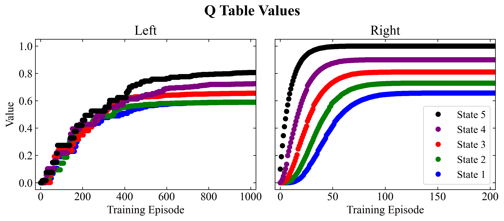

# Tic-Tac-Toe

Apply Machine Learning to simple game: Tic-Tac-Toe

## Introduction
Not intended to be visually appealing or for human game-play. Main objective is to quantitatively explore different (computer) game-play strategies.

## Basic Usage
```
from board import Board, BoardCache
from board import CELL_O
```

Creating a board and playing a move:
```
board = Board()
board = board.play_move(1)
```

Get a 2D display of the board
```
board.board_2d
```

Get a list of the indices already occupied (illegal_move) and a list of the valid moves
```
board.illegal_move
board.get_valid_move_indexes()
```

Play a game
```
board = Board()
board = board.play_move(3)
board = board.play_move(4)
board = board.play_move(1)
board = board.play_move(2)
board = board.play_move(5)
board = board.play_move(6)
```

Visualize the board:
```
board.board_2d
board.print_board()
```

Is the game over?
```
board.is_gameover()
```

Who won?
```
board.get_game_result()
```

## Available Strategies
1. Random
2. Random with Tiers: center, corner squares, edge middle squares (add picture of these squares)
3. Minimax
4. Minimax with preference for center square

## References
Following this blog post
https://nestedsoftware.com/2019/06/15/tic-tac-toe-with-the-minimax-algorithm-5988.123625.html

Code based on this repository:
https://github.com/nestedsoftware/tictac/blob/220bbdc6103ff012ec60b5b424e1566205349588/tictac/board.py#L182

Tic-Tac-Toe Math:
http://www.se16.info/hgb/tictactoe.htm

## Summary of Results
The source code for analyzing and visualizing the results from different game strategies can be found in ```GameAnalysis.py```

### Random Move Choice
Using ```play_tic_tac_toe``` a high number of random games (each player chooses moves random from a list of possible moves) can be played. From these games statistics can be generated to get a break down of the results. 

|              | (mean ± std. dev) |
|--------------|:--------------:|
| Ties  	     | 13.739 ± 1.097 |
| X Wins       | 57.362 ± 1.525 |
| O Wins       | 28.899 ± 1.431 |
| -            | -              |
| 5 Move Games | 9.484 ± 0.913  |
| 6 Move Games | 8.677 ± 0.899  |
| 7 Move Games | 26.583 ± 1.412 |
| 8 Move Games | 20.223 ± 1.283 |
| 9 Move Wins  | 21.296 ± 1.318 |

The break down of ties, X wins, and O wins are in good agreement with the result from nestedsoftware.com. But I was more curious if these results made practical sense.

Because the game is very simple it is possible to analytically solve the number of possible board permutations. Which can be found at http://www.se16.info/hgb/tictactoe.htm. Because the percentage of board orientation did not seem to align with the observed winning percentages from my random games, I decided to investigate further to see where the discrepency lay (if at all). 

I wrote a recursive function ```board_state_moves_and_result``` to systematically record every possible board position. The results are tabulated below:
|   5 Moves |   6 Moves |   7 Moves |   8 Moves |   9 Moves |   Ties |  Total Games |
|----------:|----------:|----------:|----------:|----------:|-------:|-------------:|
|      1440 |      5328 |     47952 |     72576 |     81792 |  46080 |        255168|

Unsurprisingly, these results are identical to the results obtained from www.se16.info. Then using these results and some logical thinking, one can determine the expected number of games that will end at each move. 

1. 9! / (9-5)! = 15120 is the number of game states after the 5th move
2. 1440 game states are won on move 5 and therefore *DO NOT* proceed to the sixth move
3. There are therefore (9! / (9-5)! - 1440) * (9-5) game states after the 6th move
4. 5328 games states are won on move 6
5. ((9! / (9-5)! - 1440) * (9-5) - 5328) * (9-6) = game states after the 7th move
6. (((9! / (9-5)! - 1440) * (9-5) - 5328) * (9-6) - 47952) * (9-7) = game states after 8th move
7. ((((9! / (9-5)! - 1440) * (9-5) - 5328) * (9-6) - 47952) * (9-7) - 72576) * (9-8) after the 9th move

The percentage of games that are won after each nth move can then calculated.  

|              |        5 Moves |        6 Moves |        7 Moves |        8 Moves |        9 Moves |           Ties |         X Wins |        O Wins |
|--------------|---------------:|---------------:|---------------:|---------------:|---------------:|---------------:|---------------:|--------------:|
| Analytical   |          9.524 |          8.810 |         26.429 |         20.000 |         22.540 |           12.7 |           58.5 |          28.8 |
| Estimaged    |  9.484 ± 0.913 |  8.677 ± 0.899 | 26.583 ± 1.412 | 20.223 ± 1.283 | 21.296 ± 1.318 | 13.739 ± 1.097 | 57.362 ± 1.525 | 28.899 ± 1.431|

Using the analytical results we can visualize the positions that are most frequently played for wins, losses, ties.


From this image we can deduce that the middle square is played frequently by the winner and played infrequently by the loser - i.e. the middle square is likely the most valuable square. This makes sense from our intuition as well because of the 8 possible winning orientations, 4 of them (50%) involve the middle square. The results also indicate that the corner squares are the second most valuable places (each corner square is involved in 3 winning orientations), where the edge middle squares are the least valuable (each only involved in 2 winning orientations). 

Varying game strategies can be created to test this hypothesis about the relative values of each square (center > corners > edge middle). 

The results displayed above seem to corroborate our hypotheis about the relative values of each position. Strategies that favor taking the edge middle positions perform the worst, while strategies that favor the center position perform the best. This seems to hold whether playing first or playing second.

### MiniMax Strategy

|                           |              Random 2 |      Minimax 2      |   Minimax: Center 2 | Minimax: Center > Corners |        
|---------------------------|----------------------:|--------------------:|--------------------:|--------------------------:|
| Random 1                  | [0.583, 0.298, 0.119] | [0.0, 0.769, 0.231] | [0.0, 0.852, 0.148] |       [0.0, 0.821, 0.179] |
| Minimax 1                 |   [0.972, 0.0, 0.028] |     [0.0, 0.0, 1.0]	|     [0.0, 0.0, 1.0]	|           [0.0, 0.0, 1.0] |
| Minimax: Center 1         |   [0.985, 0.0, 0.015] |     [0.0, 0.0, 1.0]	|     [0.0, 0.0, 1.0]	|           [0.0, 0.0, 1.0] |
| Minimax: Center > Corners |   [0.975, 0.0, 0.025] |     [0.0, 0.0, 1.0]	|     [0.0, 0.0, 1.0]	|           [0.0, 0.0, 1.0] |

Player 1:
[[ 1  0 -1]
 [-1  1  1]
 [ 0  0 -1]]
When in this situation, playing a the corner square commits to a tie, while playing one of the middle edge corners still leaves open the possibility for a win. This is why using the minimax strategy that prefers corners over middle edge squares performs slightly worse than a minimax strategy that only has a preference the center square.
This conclusion is qualitative and was drawn from investigating several games of different minimax strategies vs a random player.
 
 Player two:
 [[ 1  0  0]
 [ 0 -1  0]
 [ 0  1  0]]
 In this situation, playing bottom left or top right are reasonable moves, but on the chance that player 1 blocks those moves, player 2 is forced to play a defensive move to block a player 1 win. This is not good because defensive moves are wasted moves and decreases one's chance of winning. A better strategy, especially against a random play is to play the left middle edge square, then a block by player 1 does not set up a forced move by player 2 - this leaves more chances for player 2 to play offensively (increasing the chance for winning). Again, this conclusion is only qualitative, but logical. It is interesting to see this because in this situation there is only one "best" move. Perhaps the strategy can be surmised as:
 1. Don't lose (block opponent when necessary)
 2. Play a move to threaten a win: make a two in a row and force opponent to block, **BUT** don't set yourself up that your opponent's blocking move, forces you to make a defensive move - again defensive moves are wasted moves because they significantly decrease one's chance of winning (stay on offense).

### Tabular-Q Strategy
#### "Treasure Hunt"
Using a slightly simpler game: There are 6 states, at each state the agent can move left or right. The agent starts at State 1, and the agent wins the game upon reaching State 6 (where the treasure lies). State 6 has a reward of 1, while all other states have no reward. Going left at State 1, just returns the agent to State 1. 

| State 1 | State 2 | State 3 | State 4 | State 5 | State 6 |
|--------:|--------:|--------:|--------:|--------:|--------:|
| 0       | 0       | 0       | 0       | 0       | 1       |

The two images that follow show the evolution of the QTable values as more training games are played. First what we notice is that after about 100 training games, the q-values for a movement to the right plateau and reach a steady-state; the same occurs for a movement to the left, but it just much longer. The difference in the number of training games to reach steady-state is mainly a function of the epsilon value: an epsilon value of 0 will lead to the values in "left" and "right" plateauing at the same time, and smaller epsilon values will lead to plateaus that occur at more similar times. 

The second thing to notice is that at steady-state, the values of moving to the right are always higher than the values of moving to the left (ratio is .9^2). This is exactly what we expect - if the "treasure" is always on the right, always go right. The first figure shows the the q-values when using a single q-table; the second figure shows the evolution of the q-values when using Double Q-Learning. What we can see is that single and double Q-learning produce the same steady-state values, however double Q-learning seems to take twice as long to reach the plateau. 




#### Tic-Tac-Toe
I was having some difficulty understanding why Q-Learning was not performing as well as I would like - even after many training games, the Q-player was still losing a small percentage of the games which I thought did not make sense. And it appears to be due to the reward value. Originally the reward has been loss: -1; tie: 0; win: 1. Which makes sense intuitively: win > tie > loss. Because Q-Learning is still a bit of a black box to me, I started to go down some different rabbit holes to try and figure out why I wasn't getting the results I wanted / expected. I started looking at the games that the Q-player was losing (even after being trained). One such board of interest was:
<pre>
[[ X  O  X]  
 [ -  O  -]  
 [ -  -  -]] 
</pre>


Hypothesis: when training the Q-Table against a mini-max player the maximum value for any move should be <0, because playing against a minimax player will at best produce a tie.
But when trained against a random player, some of the values can be greater than 0, because a random player will leave open the chance for winning. 
